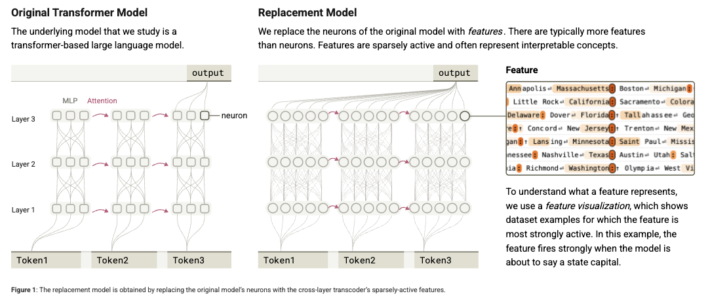
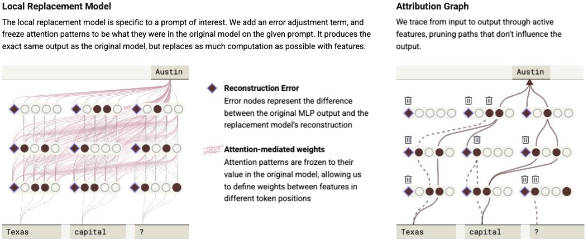
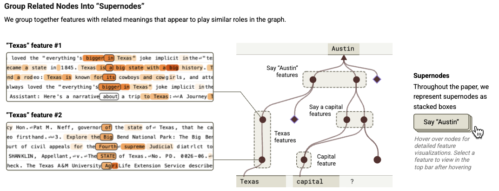
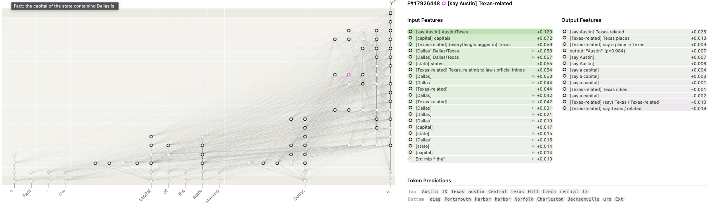

## Review of On the Biology of a Large Language Model

Paper: [On the Biology of Large Language Models](https://transformer-circuits.pub/2025/attribution-graphs/biology.html)

### Overview

- Reverse engineer how LLMs models work on the inside. 
- Probing the insides of language models 
- Representation of interpretable concepts – “features” –  embedded within modles' internal activity
-  How these features interact - [Circuit Tracing: Revealing Computational Graphs in Language Models](https://transformer-circuits.pub/2025/attribution-graphs/methods.html)
- *Attribution graphs*: partially trace the chain of intermediate steps that a model uses to transform a specific input prompt into an output response.
- Claude 3.5 Haiku routinely uses multiple intermediate reasoning steps “in its head”. That is, during the forward pass rather than the "thinking out loud" of a chain-of-thought completion.
- *Forward planning*, considering multiple possibilities for what it will say well in advance of saying it. 
- *Backward planning*, working backwards from goal states to formulate earlier parts of its response.

> Our methods study the model indirectly using a more interpretable “replacement model,” which incompletely and imperfectly captures the original.

### Methodology 

Studying transformer based language modeles, with two fundemental concepts; MLP, process information within each token position using collections of neurons. And layers, which move information between token positions.

- Models are difficult to interpret because they are polysemantic, they perform functions that can seem unrelated.
    - In part because of *superposition* whereby models represent more concepts than they have neurons and thus cannot assign each neuron to its own concept.
- The replacement model built reproduces the activations of the original model using more interpretable components. 
    - The replacement model is based on a cross-layer transcoder (CLT) architecture.
    - The CLT used had 30 M feautres across all layers. 
    - Attention layers between the models are the same and fixed components. 

    

- Features in the model represent human-interpretable concepts, low-level to high-level.
- Error nodes to represent the discrepency of the replacement model and the original.
- On the attribution graphs:
    - A graphical representation of the computational steps the model uses to determine its output for a particular input.
    - Nodes represent features and edges represent the causal interactions between them.
    - Manually grouping related graph nodes together into supernodes to create a simplified depiction

- To verify the replacement model: Intervention experiments in the original model, such as inhibiting feature groups and observing their effects on other features and on the model’s output.

## Case Studie

### Introductory Example: Multi-step Reasoning

Simple example where the model performs “two-hop” reasoning “in its head” to identify that “the capital of the state containing Dallas” is “Austin.”

#### Prompt: Fact: the capital of the state containing Dallas is

- Reasoning in two steps:
    - inferring that the state 
    - the capital of Texas 
- Does the model perform the two steps internally or use some form of "short cut"

#### Insight into model 
- Several features about the word and/or concept of a capital city.
- Features that represent the concept of capitals in more general ways. One example is this feature, which activates on the word “capitals” but also later in questions about capitals of states.
- Multilingual feature, which activates most strongly on a variety of phrases including “başkenti”, “राजधानी”, “ibu kota”, and “Hauptftadt” — all of which roughly mean “capital” in different languages.
- The core observation is that the features represent the idea of "capital"
- “output features” that consistently push the model to say certain tokens, even if there isn’t such a clear pattern to what words/phrases they activate on. 
- The “Top Outputs” information is not always informative – for instance, earlier-layer features primarily matter via indirect effects on the output via other features, and their top direct outputs are not too consequential.
- “Output feature” requires a holistic evaluation of its top direct outputs, the contexts in which it activates, and its role in the attribution graph.
- Features that promote outputting the name of a capital more generally, which we use a mix of both types of signals to identify and label.

#### Validation

- Intervention experiments on the feature groups by inhibiting each of them.
    - Clamping them to a negative multiple of their original value.
    - Inhibiting “Dallas” features decreases the activation of “Texas”
    - Inhibiting the “Dallas” cluster causes the model to output other state capitals, while inhibiting the “say a capital” cluster causes it to output non-capital completions.

### Planning in Poems

How does Claude 3.5 Haiku write a rhyming poem?

- The lines need to rhyme.
- They need to make sense.
- Two ways to achieve this:
    - Pure improvisation; write the beginning of each line whiout reagrd for the rhyme in the end. At the end of each line choose a word that rhymes and makes sense.
    - Planning; At the *beginning* of each line come up with the word it plans to use at the end. 

> Language models are trained to predict the next word, one word at a time. Given this, one might think the model would rely on pure improvisation. However, we find compelling evidence for a planning mechanism.

- Model often activates features corresponding to end-of-next-line words *prior* to writing the line. 
- Both forward planning and backwards planning.
    - The model uses the semantic and rhyming constraints of the poem to determine candidate targets for the next line. Next, the model works backward from its target word to write a sentence that naturally ends in that word.
- Holds multiple possible planned words “in mind” at the same time.
- Able to edit the model’s planned word and see that it restructures its next line accordingly.
- Planning Features Only Matter at the Planning Location
    - Planning occurs at the newline token.
    - Features are only active over the planning token.
- Planned words influence Intermediate words
> The same “rabbit” planning features are active in the graph, promoting a group of “comparison features”, which are active before text such as “like a”. The model goes from the planned target (“rabbit”) that activates at the newline and reasons backwards, creating a plausible transition to get to it.

